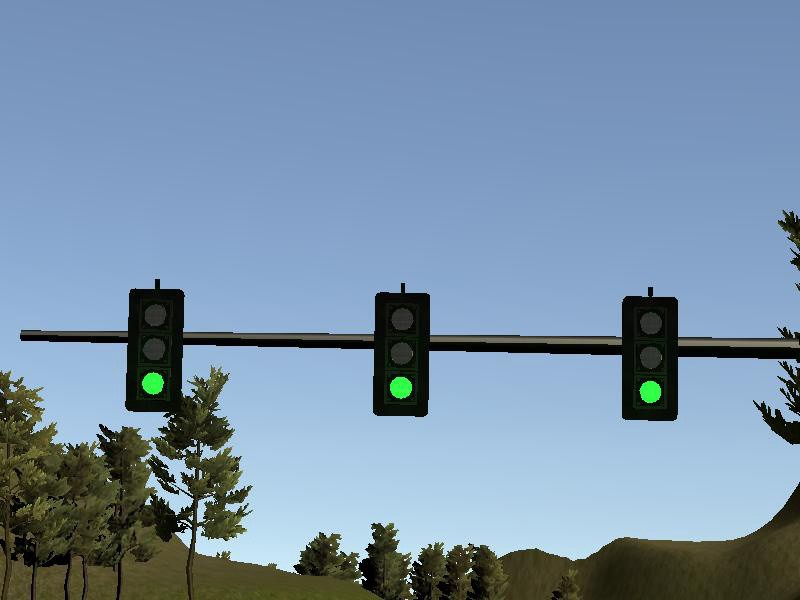
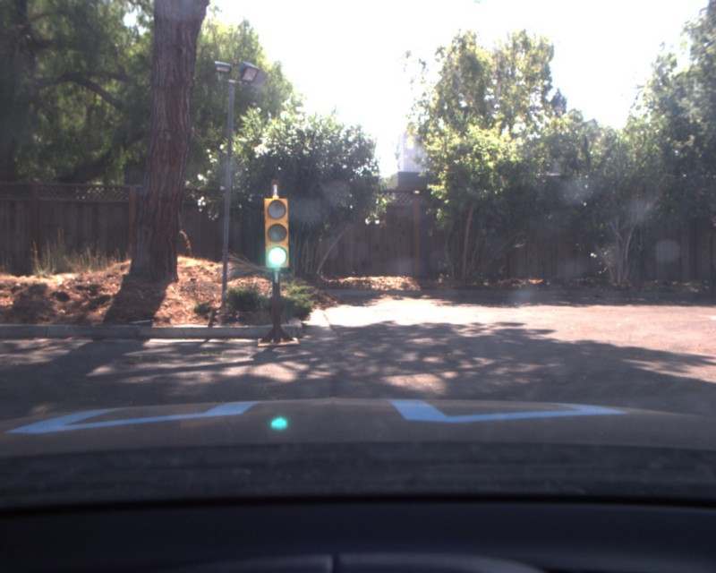
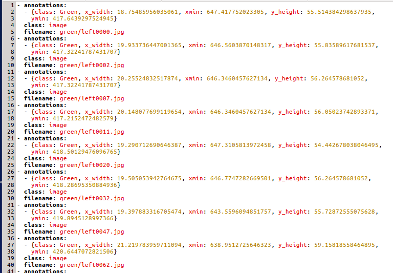

# CarND-TrafficLight-Detection-Dataset

**Step 1: Gather the data**

As with any machine learning exercise, we first need to gather our data on which we will train the model. The simulator images look something like this:



Real data image:



**Step 2: Label and annotate the images**

The next step is to manually annotate the images for the network. There are many open source tools available for this like [LabelImg](https://github.com/tzutalin/labelImg), [Sloth](https://github.com/cvhciKIT/sloth), etc. The annotation tools create a yaml file that looks something like this:




### Setup the Tensorflow Models

1. Do `git clone https://github.com/tensorflow/models.git` inside the tensorflow directory.

2. We will work with python 2, so activate respective virtual environment.

3. Follow the instructions at [this page](https://github.com/tensorflow/models/blob/master/research/object_detection/g3doc/installation.md) for installing some simple dependencies.

4. Go to research directory - `cd tensorflow/models/research/` and run following commands:

   ```pyt
   python setup.py build
   python setup.py install
   python slim/setup.py build
   python slim/setup.py install
   protoc object_detection/protos/*.proto --python_out=.
   export PYTHONPATH=$PYTHONPATH:`pwd`:`pwd`/slim
   ```

5. Now that installation is done, test it:

   ```pyt
   python object_detection/builders/model_builder_test.py
   ```

### Creating TFRecord files:

`python data_conversion_udacity_sim.py --output_path data/sim_data.record`

`python data_conversion_udacity_real.py --output_path data/real_data.record`

**Credits**

To save the time and effort, I followed the post from https://becominghuman.ai/@Vatsal410 and https://medium.com/@anthony_sarkis, where they have shared shared his annotated data-set openly available for all to use. Thank you to them for that.


